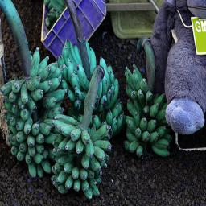

# CVDL-Image-Caption
This repository host the project of WS222/23 Course "Computer Vision and Deep Learning: Visual Synthesis" of Ludwig Maximilian University of Munich.\
In this project, a small-scale CNN+Transformer model was constructed for the image caption generation task.\
As this repository does not contain any datasets, output files or checkpoint files for the model. Therefore this README is intended to provide guidance on how to reproduce the project.

## Team members

[Wenfeng Zhu](https://github.com/Wenfeng-Zhu), [Peiwen Du](https://github.com/dupeiwen123)

## 1. Install

The project was using python 3.10. Dependencies can be installed via the requirements file.\
```
pip install -r requirements.txt
```

## 2. Dataset

### 2.1 Training Data
The dataset that this project used is COCO-2017. The datasets can be downloaded
from [here](https://cocodataset.org/#download), and choose [2017 Train images], [2017 Val images] 
and [2017 Train/Val annotations].

### 2.2 Word Embeddings
This project uses a local word vector file to constructing vocabulary and word embedding. 
The pre-trained word vectors can be downloaded from [here](https://nlp.stanford.edu/projects/glove/), 
the version we used in this project is GloVe.6B.300.


## 3. Directories
You can choose to create the following directories under this project:
1. `CVDL-Image-Caption\datasets-original`: The folder used to store three coco datasets: `train2017`, `val2017` and `annotations_trainval2017`
2. `CVDL-Image-Caption\embeddings`: Used to store GloVe word vectors
3. `CVDL-Image-Caption\datasets-processed`: Directory to save the processed datasets

Or you can go to the file `CVDL-Image-Caption\functions\utils.py` to edit the path information, make it point to the path you want.

## 4. Data Pre-Processing

Once you have the above dataset ready and the directories set, you can run:\
```
CVDL-Image-Caption\data_pre-processing.py
```
The segmented data is stored in the `CVDL-Image-Caption\datasets-processed` directory as `hdf5` , `json` and `pth` format.

## 4. Training

### 4.1 Configuration
In the file `config.json`, The hyperparameters of the training model are stored here, as well as the parameters of 
some data loaders and so on. You can modify the parameters to customise the model yourself. One point worth noting is 
that the loader parameter num_work is very demanding on memory in this project and we recommend using 0 as the default 
value. If your device has more than 80GB of RAM, then values of 2 and above can be used.
### 4.2 Devices
This project is carried out under the following hardware.

|  Hardware   | model |
|:-----------:| :----: |
|     CPU     | Intel(R) Core(TM) i7-10700F CPU \@ 2.90GHz |
|     GPU     | NVIDIA GeForce RTX 3080 10GB |
| Memory(RAM) | Kingston FURY Renegade 64GB (2x32GB) 3600MHz DDR4|
Note: We do not recommend reproducing this project on a normally configured PC.
### 4.3 Run Training
Once you have set everything you need, you can run:\
```
CVDL-Image-Caption\data_training.py
```
Loss and evaluation metrics are tracked using Tensorboard. The path to tensoboard files is `CVDL-Image-Caption\logs`.

This repository provides three log files, which you can view with the following commands:
```
tensorboard --logdir=exp_1108.0156
```
The checkpoint file of the model after the training is completed is saved in the directory `CVDL-Image-Caption\checkpoints`.

In the above hardware environment, a single epoch runs for about 30-40 minutes. The default run time of 20 epochs is 
approximately 11 hours, which also contains 9 validation epochs.

## 5. Testing
In file `CVDL-Image-Caption\functions\test_utils.py`, you should set the path of the checkpoint file, for example: 
`1108.0156/checkpoint_best.pth.tar`. It allows the model to load the pre-trained weight and use it for testing.

The output of testing will be stored as `JSON` files in directory `CVDL-Image-Caption\test_out`, it contains:
  1. The generated caption
  2. Top-k generated captions
  3. Captions ground truth
  4. Transformer's Encoder-Decoder cross attention
  5. Evaluation metrics values: "bleu1, bleu2, bleu3, bleu4, gleu, meteor"


## 6. Output examples
<div align="center"></div> 
<center>Output Text => A couple of women sitting on top of a bench.</center>
<div align="center"></div>
<center>Output Text => A bunch of green bananas sitting next to each other</center>


